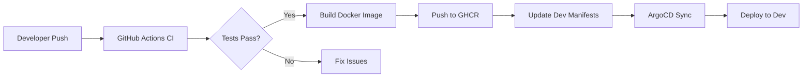
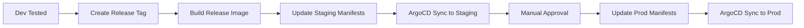

# GitOps Kubernetes Platform

A production-ready GitOps infrastructure demonstrating modern DevOps practices with Kubernetes, ArgoCD, and GitHub Actions.


## Architecture Overview

```
┌─────────────────────────────────────────────────────────────────────────┐
│                           CI/CD Pipeline                                 │
│  ┌──────────┐    ┌──────────┐    ┌──────────┐    ┌──────────────────┐  │
│  │  GitHub  │───▶│  Build   │───▶│  Docker  │───▶│  Push to GHCR    │  │
│  │   Push   │    │  & Test  │    │  Build   │    │  Update Manifests│  │
│  └──────────┘    └──────────┘    └──────────┘    └────────┬─────────┘  │
└───────────────────────────────────────────────────────────┼─────────────┘
                                                            │
                    ┌───────────────────────────────────────▼─────────────┐
                    │                  GitOps Repository                  │
                    │  ┌─────────────┐  ┌─────────────┐  ┌─────────────┐ │
                    │  │    Base     │  │   Overlays  │  │   ArgoCD    │ │
                    │  │  Manifests  │  │ (dev/stg/pr)│  │    Apps     │ │
                    │  └─────────────┘  └─────────────┘  └─────────────┘ │
                    └───────────────────────────────────────┬─────────────┘
                                                            │
                    ┌───────────────────────────────────────▼─────────────┐
                    │                     ArgoCD                          │
                    │  ┌────────────────────────────────────────────────┐ │
                    │  │  Sync │ Health Check │ Rollback │ Diff        │ │
                    │  └────────────────────────────────────────────────┘ │
                    └───────────────────────────────────────┬─────────────┘
                                                            │
          ┌─────────────────────────┬───────────────────────┴───────────────────────┐
          ▼                         ▼                                               ▼
┌──────────────────┐     ┌──────────────────┐                            ┌──────────────────┐
│   Dev Cluster    │     │  Staging Cluster │                            │  Prod Cluster    │
│  ┌────────────┐  │     │  ┌────────────┐  │                            │  ┌────────────┐  │
│  │  1 replica │  │     │  │ 2 replicas │  │                            │  │ 3 replicas │  │
│  │  min resor │  │     │  │ mid resour │  │                            │  │ full resrc │  │
│  └────────────┘  │     │  └────────────┘  │                            │  └────────────┘  │
└──────────────────┘     └──────────────────┘                            └──────────────────┘
```

## Features

- **Multi-Environment Deployment**: Dev, Staging, and Production environments with environment-specific configurations
- **GitOps with ArgoCD**: Declarative, Git-based continuous delivery
- **Kustomize Overlays**: DRY configuration management with base and environment-specific patches
- **GitHub Actions CI/CD**: Automated testing, building, and deployment pipelines
- **Container Security**: Multi-stage Docker builds, non-root containers, security scanning
- **Infrastructure as Code**: K3D cluster provisioning scripts
- **RBAC & Security**: ArgoCD RBAC, Pod Security Contexts, PodDisruptionBudgets

## Project Structure

```
.
├── app-src/                    # Application source code
│   └── backend-service/        # Go REST API
│       ├── main.go
│       ├── Dockerfile
│       └── go.mod
│
├── gitops-repo/                # Kubernetes manifests
│   ├── base/                   # Base Kustomize manifests
│   │   ├── deployment.yaml
│   │   ├── service.yaml
│   │   ├── configmap.yaml
│   │   └── kustomization.yaml
│   └── overlays/               # Environment-specific patches
│       ├── dev/
│       ├── staging/
│       └── production/
│
├── argocd/                     # ArgoCD configurations
│   ├── applications/           # ArgoCD Application CRDs
│   ├── projects/               # ArgoCD AppProjects
│   └── *.yaml                  # ArgoCD ConfigMaps
│
├── .github/                    # GitHub configurations
│   └── workflows/              # CI/CD pipelines
│       ├── ci.yaml             # Build & Test
│       ├── cd.yaml             # Continuous Deployment
│       └── release.yaml        # Release management
│
└── scripts/                    # Automation scripts
    ├── setup/                  # Cluster setup
    ├── deploy/                 # Deployment helpers
    └── monitoring/             # Health checks
```

## Quick Start

### Prerequisites

- Docker Desktop (or Docker Engine)
- kubectl
- k3d (will be installed if missing)
- Git

### 1. Bootstrap the Environment

```bash
# Make scripts executable
chmod +x scripts/setup/*.sh scripts/deploy/*.sh scripts/monitoring/*.sh

# Full bootstrap (creates clusters, installs ArgoCD, builds app)
./scripts/setup/bootstrap.sh full
```

This will:
- Create 3 K3D clusters (dev, staging, prod)
- Set up a local container registry
- Install ArgoCD on the dev cluster
- Build and push the application image
- Deploy the application to dev

### 2. Access ArgoCD

```bash
# Port forward to ArgoCD UI
kubectl port-forward svc/argocd-server -n argocd 8080:443

# Get admin password
kubectl -n argocd get secret argocd-initial-admin-secret -o jsonpath="{.data.password}" | base64 -d
```

Open https://localhost:8080 and login with `admin` and the password.

### 3. Test the Application

```bash
# Port forward to the application
kubectl port-forward svc/dev-backend-service -n gitops-demo-dev 9090:80

# Test endpoints
curl http://localhost:9090/health
curl http://localhost:9090/version
curl http://localhost:9090/api/info
```

## GitOps Workflow

### Development Flow



### Promotion Flow



## Environment Configuration

| Environment | Replicas | CPU Request | Memory Request | Auto-Sync |
|-------------|----------|-------------|----------------|-----------|
| Dev         | 1        | 25m         | 32Mi           | Yes       |
| Staging     | 2        | 50m         | 64Mi           | Yes       |
| Production  | 3        | 100m        | 128Mi          | Manual    |

## Scripts Reference

### Cluster Management

```bash
# Create all clusters
./scripts/setup/create-clusters.sh create-all

# Create specific cluster
./scripts/setup/create-clusters.sh create dev

# Switch context
./scripts/setup/create-clusters.sh switch staging

# Delete all clusters
./scripts/setup/create-clusters.sh delete-all
```

### ArgoCD Management

```bash
# Install ArgoCD
./scripts/setup/install-argocd.sh install

# Get password
./scripts/setup/install-argocd.sh password

# Apply configurations
./scripts/setup/install-argocd.sh config

# Apply applications
./scripts/setup/install-argocd.sh apps
```

### Deployment

```bash
# Promote dev to staging
./scripts/deploy/promote.sh dev-to-staging

# Promote staging to production
./scripts/deploy/promote.sh staging-to-prod

# Check promotion status
./scripts/deploy/promote.sh status
```

### Health Checks

```bash
# Full health check
./scripts/monitoring/health-check.sh all

# Check clusters only
./scripts/monitoring/health-check.sh clusters

# Check ArgoCD
./scripts/monitoring/health-check.sh argocd
```

## GitHub Actions Workflows

### CI Workflow (ci.yaml)
- Triggered on: Pull requests, pushes to main/develop
- Steps: Lint, Test, Build, Docker build test, Validate manifests, Security scan

### CD Workflow (cd.yaml)
- Triggered on: Push to main, Manual dispatch
- Steps: Build & push image, Update manifests, Notify

### Release Workflow (release.yaml)
- Triggered on: Version tags (v*.*.*)
- Steps: Create release, Build release image, Promote to staging, Promote to production (with approval)

## API Endpoints

| Endpoint | Method | Description |
|----------|--------|-------------|
| `/health` | GET | Liveness probe |
| `/ready` | GET | Readiness probe |
| `/version` | GET | Version information |
| `/api/info` | GET | Service information |

## Security Features

- **Non-root containers**: All containers run as UID 1000
- **Read-only filesystem**: Containers use read-only root filesystem
- **Dropped capabilities**: All Linux capabilities dropped
- **Service accounts**: Dedicated service accounts with minimal permissions
- **Pod Disruption Budgets**: Production has PDB for high availability
- **Security scanning**: Trivy scans in CI pipeline

## Customization

### Update Repository URL

1. Update `argocd/applications/*.yaml` with your GitHub repository URL
2. Update `argocd/projects/gitops-demo.yaml` sourceRepos
3. Update `gitops-repo/overlays/*/kustomization.yaml` image references

### Add New Environment

1. Copy an existing overlay (e.g., `gitops-repo/overlays/staging`)
2. Update `kustomization.yaml` with new namespace and settings
3. Create new ArgoCD Application in `argocd/applications/`
4. Update ArgoCD AppProject destinations

## Troubleshooting

### ArgoCD Sync Issues

```bash
# Check application status
argocd app get dev-backend-service

# Force sync
argocd app sync dev-backend-service --force

# Check logs
kubectl logs -n argocd -l app.kubernetes.io/name=argocd-application-controller
```

### Pod Issues

```bash
# Check pod status
kubectl get pods -n gitops-demo-dev

# Check pod logs
kubectl logs -n gitops-demo-dev -l app.kubernetes.io/name=backend-service

# Describe pod
kubectl describe pod -n gitops-demo-dev -l app.kubernetes.io/name=backend-service
```

## Contributing

1. Fork the repository
2. Create a feature branch
3. Make your changes
4. Run tests locally
5. Submit a pull request

## License

MIT License - see LICENSE file for details

---

Built with DevOps best practices for portfolio demonstration.

